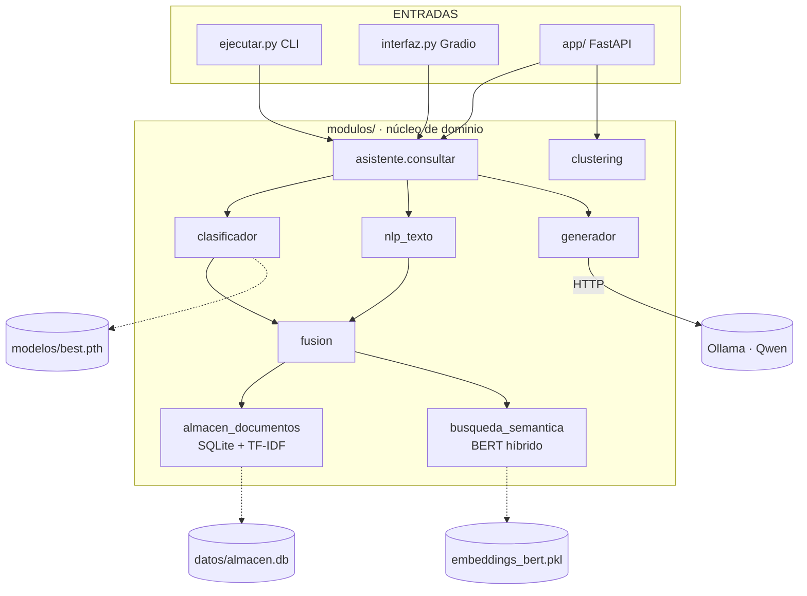
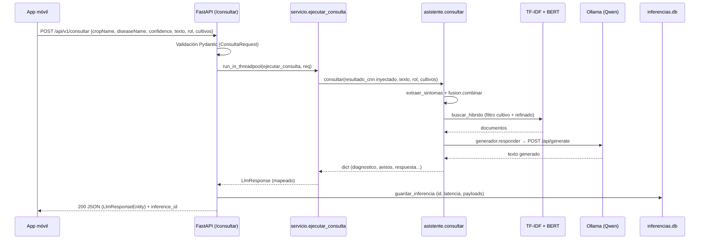
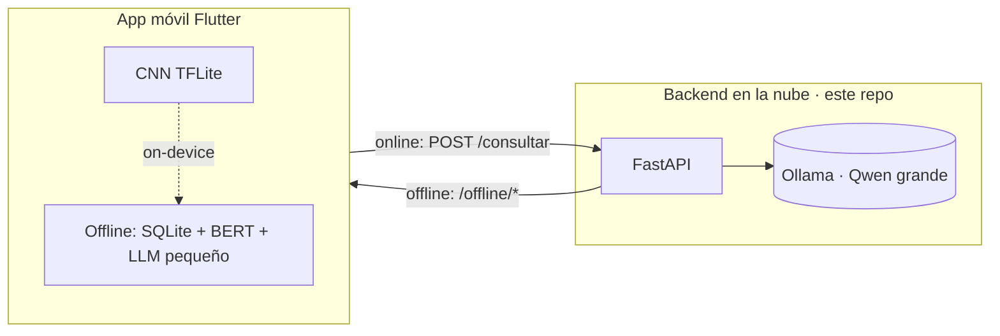
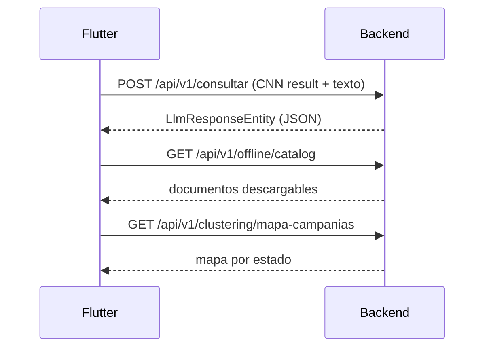
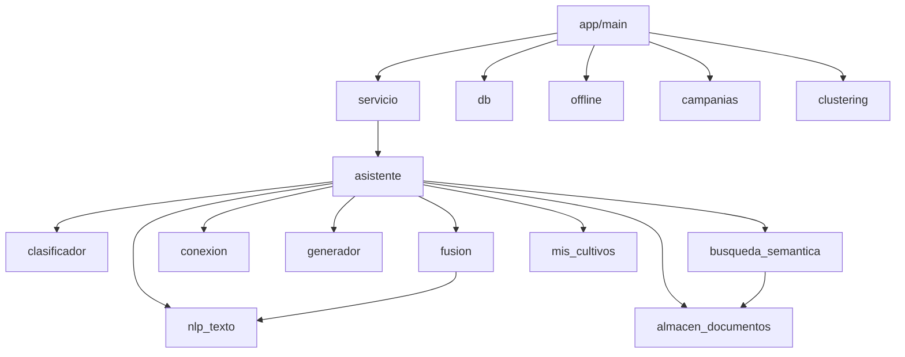
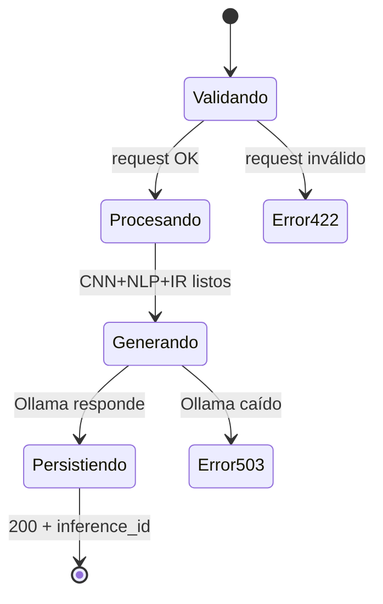

# Documentación Técnica — Sistema de Diagnóstico Agrícola (Backend IA)

> **Repositorio:** `happy2t50/modelos-LLM-nlp-` · **Tipo:** Backend de IA en Python
> (RAG + CNN + LLM + Clustering + Microservicio REST).
> **Audiencia:** Frontend (Flutter), Backend, IA, DevOps, QA.
> **Método:** todo está derivado del código real. Lo que **no aplica** o **no puede
> determinarse** se indica explícitamente.

> ⚠️ **Aclaración de alcance (leer primero).** Este repositorio es **backend/IA en
> Python**. **No** contiene frontend (React/Vue): no hay *components*, *hooks*,
> *contexts* ni *views* de SPA. El frontend es la app **Flutter AgroGraph-MAS**, en
> **otro repositorio** (`lib/`), fuera de este análisis. Las secciones de la plantilla
> orientadas a frontend se mapean a sus equivalentes reales (módulos Python, endpoints
> REST) y se marca lo que no aplica.

---

## Índice navegable

1. [Visión general](#1-visión-general)
2. [Estructura del proyecto](#2-estructura-del-proyecto)
3. [Arquitectura](#3-arquitectura)
4. [Rutas (endpoints REST)](#4-rutas-endpoints-rest)
5. [Componentes → Módulos Python](#5-componentes--módulos-python)
6. [Hooks](#6-hooks)
7. [Contextos](#7-contextos)
8. [Servicios](#8-servicios)
9. [APIs](#9-apis)
10. [Flujo completo](#10-flujo-completo)
11. [Cambios realizados (historia técnica)](#11-cambios-realizados-historia-técnica)
12. [Decisiones arquitectónicas](#12-decisiones-arquitectónicas)
13. [Integración Frontend ↔ Backend](#13-integración-frontend--backend)
14. [Integración futura](#14-integración-futura)
15. [Dependencias](#15-dependencias)
16. [Variables de entorno](#16-variables-de-entorno)
17. [Convenciones](#17-convenciones)
18. [Diagramas](#18-diagramas)
19. [Glosario y estado](#19-glosario-y-estado)

---

## 1. Visión general

### Propósito
Sistema de **diagnóstico fitosanitario** para zonas con conectividad limitada. El usuario
toma una foto de una hoja y escribe síntomas; el sistema detecta cultivo+enfermedad,
recupera documentos técnicos y genera un diagnóstico con tratamiento y prevención,
adaptado al rol del usuario (agricultor / aprendiz).

### Problema que resuelve
- Acceso a conocimiento agronómico confiable en el campo.
- **Seguridad del dominio:** las respuestas salen **solo de documentos** (nunca inventa
  dosis/productos) — regla central en `modulos/generador.py`.

### Arquitectura general
Pipeline **RAG (Retrieval-Augmented Generation)** con un modelo de visión al frente:

```
Imagen → CNN (cultivo+enfermedad) ─┐
Texto  → NLP (síntomas) ───────────┤→ Fusión → Recuperación (TF-IDF+BERT) → LLM (Qwen) → Respuesta
```

### Tecnologías
| Capa | Tecnología |
|---|---|
| API | FastAPI + Uvicorn |
| Visión (CNN) | PyTorch + torchvision (EfficientNet-B4) |
| Búsqueda léxica | scikit-learn (TF-IDF) |
| Búsqueda semántica | sentence-transformers (BERT MiniLM, 384-d) |
| LLM | Qwen (GGUF) vía **Ollama** (HTTP) |
| Clustering | scikit-learn (K-Means) |
| Fine-tuning | transformers (BETO) |
| Persistencia | SQLite |
| UI de pruebas | Gradio |

### Patrón arquitectónico
**Núcleo + adaptadores.** `modulos/` es la lógica de dominio reutilizable; `app/`
(FastAPI) y `ejecutar.py`/`interfaz.py` son adaptadores que la *invocan*. El orquestador
`modulos/asistente.py` es el punto de composición (patrón *Facade*).

### Flujo general
Online (con cobertura): app móvil → microservicio en la nube (RAG + LLM grande).
Offline (sin cobertura): la app responde en el dispositivo con modelos pequeños (fuera de
este repo; el backend le entrega el corpus + embeddings vía endpoints `offline`).

---

## 2. Estructura del proyecto

```
modelo/
├── modulos/          NÚCLEO de dominio (lo que corre en producción)
│   ├── clasificador.py        CNN EfficientNet-B4: foto → cultivo+enfermedad+confianza
│   ├── nlp_texto.py           Extrae síntomas canónicos del texto (léxico ES, sin deps pesadas)
│   ├── fusion.py              Combina CNN + NLP; ajusta confianza; arma consulta enriquecida
│   ├── mis_cultivos.py        Cultivos de la parcela (tabla SQLite)
│   ├── almacen_documentos.py  SQLite + índice TF-IDF + caché Top-K + carga/troceado
│   ├── busqueda_semantica.py  Embeddings BERT + búsqueda híbrida (0.4 TF-IDF / 0.6 BERT)
│   ├── conexion.py            Detección de internet (socket TCP a DNS)
│   ├── generador.py           Cliente de Qwen (Ollama HTTP); prompt por rol; parseo de secciones
│   ├── asistente.py           ORQUESTADOR: une CNN+NLP+fusión+recuperación+LLM
│   └── clustering.py          K-Means fitosanitario (feature vector del plan) + normalización
│
├── app/              MICROSERVICIO REST (FastAPI) — modo online
│   ├── main.py                App FastAPI: define endpoints, lifespan (warmup), errores
│   ├── config.py              Configuración por variables de entorno
│   ├── schemas.py             Modelos Pydantic (contratos request/response)
│   ├── servicio.py            Adaptador: mapea la API a asistente.consultar()
│   ├── db.py                  Historial de inferencias + clustering (SQLite inferencias.db)
│   ├── offline.py             Catálogo + descarga de documentos con embeddings (RAG on-device)
│   └── campanias.py           Mapa epidemiológico real (CSV SENASICA por estado)
│
├── scripts/          CONSTRUCCIÓN Y EVALUACIÓN (no corren en producción)
│   ├── construir_corpus.py            Arma el corpus combinado + índices + embeddings
│   ├── evaluar_busqueda.py            Métricas del motor (TF-IDF vs BERT vs híbrido)
│   ├── finetune_beto.py               Fine-tuning de BETO (texto → cultivo)
│   ├── comparar_cnns.py               Comparación de 3 CNNs
│   ├── entrenar_clustering.py         K-Means diagnósticos (sintético)
│   ├── entrenar_clustering_documentos.py  K-Means sobre embeddings del corpus (real)
│   └── entrenar_clustering_campanias.py   K-Means campañas SENASICA (real, epidemiológico)
│
├── tests/            Pruebas por módulo (test_*.py) — 8 suites
├── datos/            Artefactos generados (SQLite, índices, corpus) + campanias/*.csv
├── documentos/       Documentos fuente curados (.txt con metadatos)
├── modelos/          Pesos: best.pth (CNN), modelo_beto/, clustering_*.pkl (no versionados)
├── docs/             Documentación y reportes de métricas
├── extras/           Material no usado por el código (vectores_cultivos.pkl)
├── ejecutar.py       Punto de entrada CLI
├── interfaz.py       Punto de entrada web de pruebas (Gradio)
├── requirements.txt  Dependencias
└── CLAUDE.md         Contexto/decisiones del proyecto
```

**Responsabilidad de cada carpeta**

| Carpeta | Responsabilidad | ¿Producción? |
|---|---|---|
| `modulos/` | Lógica de dominio reutilizable (el corazón) | Sí |
| `app/` | Exposición HTTP del núcleo | Sí (online) |
| `scripts/` | Construir datos y entrenar/evaluar modelos | No |
| `tests/` | Verificación por módulo | No |
| `datos/` | Base SQLite, índices, corpus (se regeneran) | Sí (lectura) |
| `documentos/` | Fuentes curadas para el corpus | Insumo |
| `modelos/` | Pesos de modelos (pesados, gitignored) | Sí |
| `docs/` | Documentación y métricas | No |
| `extras/` | No usado por el código | No |

---

## 3. Arquitectura

### 3.1 Vista por capas



### 3.2 Cómo viaja la información
1. La entrada (CLI/Gradio/API) llama a `asistente.consultar(imagen, texto, rol, cultivos, ...)`.
2. `consultar` obtiene el diagnóstico de la CNN (o lo recibe inyectado), extrae síntomas
   (NLP) y los fusiona (`fusion.combinar`) → consulta enriquecida + confianza ajustada.
3. Recupera documentos con `busqueda_semantica.buscar_hibrido` (filtrado por cultivo,
   refinado por cultivo diagnosticado + relevancia).
4. `generador.responder` arma el prompt con los documentos y llama a Ollama (Qwen).
5. Devuelve un `dict` estructurado (diagnóstico, avisos, respuesta, documentos).

### 3.3 Responsabilidades por capa
| Capa | Responsabilidad | No hace |
|---|---|---|
| Entradas (`app/`, CLI, Gradio) | Validar, traducir HTTP↔llamadas, serializar | Lógica de modelos |
| Núcleo (`modulos/`) | Todo el razonamiento (visión, NLP, IR, generación) | HTTP, persistencia de historial |
| Externo (Ollama) | Inferencia del LLM | — |

---

## 4. Rutas (endpoints REST)

> Definidos en `app/main.py`. Prefijo `PREFIJO_API = /api/v1` (`app/config.py`).
> Documentación interactiva automática en `/docs` (Swagger) y `/openapi.json`.

| Método | Ruta | Archivo/función | Propósito |
|---|---|---|---|
| POST | `/api/v1/consultar` | `main.consultar_endpoint` → `servicio.ejecutar_consulta` | Diagnóstico (CNN result + texto → RAG + LLM) |
| GET | `/api/v1/inferences` | `main.historial_endpoint` → `db.listar_inferencias` | Historial paginado (`limit`, `offset`) |
| GET | `/api/v1/inferences/{id}` | `main.detalle_endpoint` → `db.obtener_inferencia` | Detalle de una inferencia |
| POST | `/api/v1/clustering/inferir` | `main.clustering_inferir` → `clustering.predecir_cluster` | Asigna cluster fitosanitario (no supervisado) |
| GET | `/api/v1/clustering/mapa` | `main.clustering_mapa` → `db.mapa_epidemiologico` | Mapa de diagnósticos por zona |
| GET | `/api/v1/clustering/mapa-campanias` | `main.clustering_mapa_campanias` → `campanias.mapa` | **Mapa epidemiológico REAL** (SENASICA por estado) |
| GET | `/api/v1/offline/catalog` | `main.offline_catalog` → `offline.catalogo` | Catálogo de documentos descargables |
| GET | `/api/v1/offline/documents/{id}` | `main.offline_document` → `offline.documento` | Documento con chunks + embeddings (384-d) |
| GET | `/health` | `main.health` | Liveness |
| GET | `/ready` | `main.ready` | Readiness (comprueba Ollama) |

**Parámetros / navegación:** ver los contratos en §13. No hay navegación tipo SPA (es una API).

---

## 5. Componentes → Módulos Python

> "Componentes" (frontend) **no aplica**. El equivalente son los **módulos de dominio**.
> Para cada uno: ubicación, responsabilidad, funciones públicas clave, dependencias.

### `modulos/clasificador.py` (202 líneas)
- **Responsabilidad:** CNN de imagen → cultivo+enfermedad+confianza.
- **Modelo:** EfficientNet-B4 (torchvision), 50 clases, pesos en `modelos/best.pth`.
- **Público:** `predecir(ruta_imagen) → {cultivo, enfermedad, confianza, clase_cnn, confianza_baja}`.
- **Interno:** `_cargar_modelo` (singleton perezoso), `_separar_clase` (parsea 3 formatos de etiqueta), `_construir_transformacion` (Resize 380 + normalización ImageNet).
- **Depende de:** torch, torchvision, PIL.

### `modulos/nlp_texto.py` (180 líneas)
- **Responsabilidad:** interpretar el texto del usuario → lista de síntomas canónicos.
- **Público:** `limpiar(texto)`, `extraer_sintomas(texto) → list[str]`.
- **Diseño:** solo stdlib (`re`, `unicodedata`) + léxico ES. Sin spaCy/NLTK (dependencias mínimas).

### `modulos/fusion.py` (207 líneas)
- **Responsabilidad:** combinar CNN + NLP.
- **Público:** `combinar(resultado_cnn, sintomas_nlp) → dict`, `diagnosticar(resultado_cnn, texto)`.
- **Lógica:** refuerza/contradice la confianza (±0.15) según coincidencia de síntomas; arma la consulta enriquecida.

### `modulos/mis_cultivos.py` (128 líneas)
- **Responsabilidad:** cultivos de la parcela (tabla SQLite `mis_cultivos`).
- **Público:** `agregar`, `quitar`, `listar`, `existe`, `limpiar_todo`.

### `modulos/almacen_documentos.py` (396 líneas)
- **Responsabilidad:** almacén SQLite + índice TF-IDF + caché Top-K + carga/troceado.
- **Público:** `cargar_desde_directorio`, `agregar_corpus` (troceado), `construir_indice`,
  `buscar(consulta, cultivos, top_k)`, `guardar_topk`/`recuperar_topk`, `listar_documentos`.
- **Esquema:** tablas `documentos(cultivo, enfermedad, fuente, texto, fragmento)` y `cache_topk`.

### `modulos/busqueda_semantica.py` (272 líneas)
- **Responsabilidad:** embeddings BERT + búsqueda híbrida.
- **Modelo:** `paraphrase-multilingual-MiniLM-L12-v2` (384-d).
- **Público:** `construir_embeddings`, `buscar_semantico`, `buscar_hibrido(consulta, cultivos, top_k, peso_tfidf=0.4, peso_bert=0.6)`.

### `modulos/conexion.py` (42 líneas)
- **Responsabilidad:** detectar internet.
- **Público:** `hay_internet(timeout=2)`, `estado_conexion()`. Socket TCP a 8.8.8.8:53 / 1.1.1.1:53.

### `modulos/generador.py` (309 líneas)
- **Responsabilidad:** cliente del LLM (Qwen vía Ollama).
- **Público:** `responder(diagnostico, sintomas, documentos, rol, modelo) → dict`.
- **Interno:** `_construir_prompt` (reglas de seguridad + estilo por rol), `_llamar_ollama`
  (POST `/api/generate`, `stream:False`, `temperature:0.2`), `_extraer_secciones`,
  `_quitar_pensamiento`. Constante `_MAX_DOCS_PROMPT=4` (env `MAX_DOCS_LLM`).

### `modulos/asistente.py` (333 líneas) — ORQUESTADOR
- **Responsabilidad:** unir todo el pipeline (patrón Facade).
- **Público:** `consultar(imagen, texto, rol, cultivos, resultado_cnn, forzar_offline, fn_generar, top_k, ...)`, `precargar_cache`.
- **Interno:** `_refinar` (prioriza cultivo diagnosticado + filtra relevancia), `_avisos_imagen`.

### `modulos/clustering.py` (167 líneas)
- **Responsabilidad:** clustering fitosanitario (no supervisado).
- **Público:** `normalizar(vec)`, `generar_dataset`, `predecir_cluster(vec)`.
- **Modelo:** K-Means (k=6), 13 features del `AgendaFeatureVector` del plan.

**Archivos de `app/`** (ver §8 Servicios y §4 Rutas): `main.py`, `config.py`, `schemas.py`,
`servicio.py`, `db.py`, `offline.py`, `campanias.py`.

---

## 6. Hooks

**No aplica.** Los *hooks* son un concepto de React (frontend). Este backend no los tiene.

**Equivalente conceptual en el código:** la **carga perezosa con *singleton*** de modelos
pesados — un patrón para inicializar una sola vez y reutilizar:
- `clasificador._cargar_modelo` (variable global `_modelo`).
- `busqueda_semantica._obtener_modelo`.
- `clustering._cargar` / `offline._emb_map` (caché en memoria).

El *warmup* de estos singletons se dispara en el evento `lifespan` de FastAPI (`app/main.py`).

---

## 7. Contextos

**No aplica.** No hay *Context API* (estado global de React). Este backend es en gran parte
**stateless**: cada petición trae sus datos (imagen, texto, rol, cultivos), y el corpus es de
solo lectura.

**Equivalente conceptual:**
- **Configuración global:** `app/config.py` (variables de entorno) y las constantes de
  `modulos/generador.py`.
- **Estado compartido de solo lectura:** los *singletons* de modelo (§6) y los índices/
  embeddings cargados en memoria.
- **Estado persistente:** SQLite (`datos/almacen.db`, `datos/inferencias.db`).

---

## 8. Servicios

> "Servicios" = módulos que hacen E/S (HTTP, BD) o encapsulan lógica de aplicación.

### Cliente HTTP saliente — `modulos/generador.py`
- **Llamada:** `POST {OLLAMA_URL}` (por defecto `http://localhost:11434/api/generate`).
- **Payload:** `{model, prompt, stream:false, think:false, options:{temperature:0.2}}`.
- **Respuesta:** `{response: "..."}` → se limpia y parsea en secciones.
- **Errores:** `requests.ConnectionError`/`Timeout`/404/no-200 → `RuntimeError` con mensaje
  claro (la API lo mapea a 503/504).

### Adaptador de aplicación — `app/servicio.py`
- `ejecutar_consulta(req)` construye `resultado_cnn` desde el request (la CNN corre en el
  dispositivo) y llama `asistente.consultar(...)`; mapea la salida al contrato `LlmResponse`.

### Persistencia — `app/db.py`
- SQLite `datos/inferencias.db`. Tablas `inferencias` y `clustering`.
- `guardar_inferencia`, `listar_inferencias`, `obtener_inferencia`, `guardar_clustering`,
  `mapa_epidemiologico`.

### Datos offline — `app/offline.py`
- `catalogo()` (19 documentos por `(cultivo, fuente)`), `documento(id)` (chunks + embeddings 384-d).

### Datos de campañas — `app/campanias.py`
- `mapa()` agrega los CSV de SENASICA por estado (mapa epidemiológico real).

---

## 9. APIs

### API propia (expuesta)
- **Framework:** FastAPI. **Base URL local:** `http://localhost:8000`. **Prefijo:** `/api/v1`.
- **Documentación:** Swagger en `/docs`, OpenAPI en `/openapi.json` (generados automáticamente).
- **Autenticación:** ⚠️ **No implementada** en el código actual. Recomendada (API key/JWT) antes de producción (ver §14).
- **Headers:** JSON estándar (`Content-Type: application/json`) para `/consultar`, `/clustering/*`; respuestas `application/json`.
- **Formato de respuesta:** JSON validado por Pydantic (`app/schemas.py`).
- **Endpoints:** ver §4.

### API externa (consumida)
- **Ollama** (`{OLLAMA_URL}`) — inferencia del LLM. Es una dependencia dura del modo online
  (si cae → `/consultar` responde 503).

---

## 10. Flujo completo

Ejemplo: el usuario diagnostica una foto (modo online, vía microservicio).



**Paso a paso (texto):** petición → validación Pydantic → threadpool (la inferencia es
síncrona) → orquestador (NLP+fusión+IR+LLM) → mapeo al contrato → persistencia → respuesta.

---

## 11. Cambios realizados (historia técnica)

> Reconstruida del historial de git (`git log`). Se listan los cambios de mayor impacto con
> su *porqué*, alternativas y consecuencias.

### 11.1 Construcción por fases (Fases 0–8)
El sistema se construyó incrementalmente (commits `ca9262b`…`6f0beb7`): estructura →
almacén TF-IDF → BERT híbrido → mis_cultivos → NLP → fusión → generador Qwen → orquestador
online/offline → CNN real. Cada fase con pruebas. **Por qué:** reducir riesgo y validar cada
pieza antes de componer.

### 11.2 Modelo LLM: `qwen3:4b` → `qwen3.5:0.8b` (commit `a249e11` y ss.)
- **Antes:** el plan asumía `qwen3:4b`. **Problema:** demasiado pesado para el objetivo
  offline (móvil). **Solución:** `qwen3.5:0.8b` como modelo a bordo; el grande queda para la
  nube. **Alternativas descartadas:** cuantización agresiva (Q2/Q3) — degrada demasiado.
  **Impacto:** `modulos/generador.py`, `CLAUDE.md`.

### 11.3 Mejoras de calidad RAG (commit `a9800a7`)
- **Problema 1:** el 0.8b decía "no tengo dosis" aunque estuvieran en los documentos.
  **Causa:** prompt sesgado a "no inventes". **Solución:** instrucción positiva ("si SÍ
  están, INCLÚYELAS").
- **Problema 2:** se colaba un documento de otro cultivo (BERT ve textos similares).
  **Solución:** `_priorizar_cultivo` (pasar al LLM solo docs del cultivo diagnosticado) +
  `_filtrar_relevantes`. **Archivos:** `modulos/asistente.py`, `modulos/generador.py`.

### 11.4 Corpus combinado + PDFs (commits `6cc359d`, `b325d24`)
- **Antes:** 3 `.txt` de ejemplo. **Solución:** `scripts/construir_corpus.py` integra el
  JSON del equipo + PDFs (fitosanitarios + Google Drive) + `.txt` curados; trocea, limpia y
  genera índices. **Hallazgo:** las guías GIP no traen dosis; sin los `.txt` curados el
  modelo inventaba fungicidas → se conservan los `.txt`. **Impacto:** corpus 3 → **2365
  fragmentos**.
- **Cambio de esquema:** se añadió la columna `fragmento` a `documentos` y `agregar_corpus`
  para soportar troceado (antes `UNIQUE(cultivo,enfermedad,fuente)` colapsaba los chunks).

### 11.5 Latencia: enviar menos documentos al LLM (commit `02abed3`)
- **Antes:** se pasaban ~10 documentos al prompt. **Problema:** ~40–60 s/respuesta.
  **Causa real (diagnosticada con `ollama ps`):** el modelo se carga con `num_ctx=4096` por
  defecto (no 256K); 10 docs desbordan. **Solución:** `_MAX_DOCS_PROMPT=4` + recorte de
  cada doc. **Impacto:** ~21 s. **Corrección honesta:** se había afirmado "contexto 256K,
  sin overflow"; el runtime real es 4096 (documentado en `docs/microservicio_backend.md`).

### 11.6 Reorganización de estructura (commit `ab13856`)
- **Antes:** todo en la raíz. **Solución:** `modulos/` (núcleo), `app/`/entradas, `scripts/`,
  `modelos/`, `docs/`, `extras/`. Rutas y `sys.path` ajustados; verificado con tests.
  **Por qué:** escalabilidad y separación núcleo/entradas/experimentos.

### 11.7 Requisitos académicos (commits `589d652`, `32cf9f9`, `a9da667`)
- Métricas del motor (`evaluar_busqueda.py`), fine-tuning de BETO (`finetune_beto.py`),
  comparación de 3 CNNs (`comparar_cnns.py`). Resultados en `docs/METRICAS_*`.

### 11.8 Microservicio + Clustering + Offline + Datos reales (commits `35e3204`→`02c943d`)
- Microservicio FastAPI (contrato `LlmResponseEntity`), clustering no supervisado + mapa
  epidemiológico, endpoints offline (catálogo + descarga con embeddings), y **clustering con
  datos reales** de campañas SENASICA con mapa por estado.

---

## 12. Decisiones arquitectónicas

| Decisión | Por qué |
|---|---|
| **El LLM no corre en proceso; se delega a Ollama** | Simplicidad y formato GGUF; permite cambiar de modelo por env var sin tocar código |
| **La CNN corre en el dispositivo (la API la recibe inyectada)** | La CNN es ligera on-device (TFLite); el servidor hace lo pesado (RAG + LLM) |
| **`modulos/` no se toca desde `app/`** | El núcleo es reutilizable (CLI, Gradio, API, futuro empaquetado móvil) sin acoplarse a HTTP |
| **SQLite (no Postgres)** | Suficiente para el hito; sin servidor aparte. Migrable sin cambiar el contrato |
| **NLP con solo stdlib** | Dependencias mínimas (regla del proyecto); evita spaCy/NLTK pesados |
| **Generador inyectable (`fn_generar`)** | Permite probar el pipeline sin Ollama (tests) |
| **`resultado_cnn` inyectable en `consultar`** | Desacopla la CNN; testear online/offline aislado |
| **Se conservan los `.txt` curados** | Las guías GIP no traen dosis; los `.txt` sí — evitan alucinaciones |
| **Clustering sintético + real** | El de diagnósticos no tiene datos reales aún; el de campañas SENASICA sí |

---

## 13. Integración Frontend ↔ Backend

> Guía para el equipo Flutter. Contratos exactos en `app/schemas.py`.

### `POST /api/v1/consultar` (diagnóstico)
**Request (JSON):**
```json
{ "cropName": "Calabaza", "diseaseName": "oídio", "confidence": 0.47,
  "texto": "polvo blanco como ceniza", "rol": "agricultor",
  "cultivos": ["calabaza", "maiz"] }
```
**Response (compatible con `LlmResponseEntity` de la app):**
```json
{ "diagnostico": "...", "tratamiento": "...", "prevencion": "...",
  "fuentes": ["..."], "confianzaAjustada": 0.62, "estado": "reforzado",
  "explicacion": "...", "sintomas": ["oidio"], "avisos": [],
  "sinDocumentos": false, "inference_id": "inf_...", "modo": "online" }
```
**Notas:** la CNN corre en el dispositivo; el backend recibe su resultado. `rol` ∈
{`agricultor`, `aprendiz`}. `cultivos` opcional (vacío/omitido = sin filtro).

### Errores que maneja
| HTTP | Cuándo |
|---|---|
| 422 | Request inválido (validación Pydantic) |
| 404 | Inferencia/documento inexistente |
| 503 | Ollama no disponible (`/consultar`, `/ready`) |
| 504 | Timeout de Ollama |
| 500 | Error interno |

### Otros contratos
- Historial: `GET /api/v1/inferences?limit&offset` → `{total, items[]}`.
- Offline: `GET /api/v1/offline/catalog` → `{documents[]}`; `GET /api/v1/offline/documents/{id}`
  → `{content, embedding(384), chunks[{text, embedding(384)}]}`.
- Mapa real: `GET /api/v1/clustering/mapa-campanias` → `{total_campanias, estados[]}`.

> ⚠️ **Embeddings de 384 dimensiones** (MiniLM), no 768. El cliente debe embeber la query
> con el **mismo modelo** para que el coseno on-device cuadre.

---

## 14. Integración futura

| Punto de integración | Dónde |
|---|---|
| **Autenticación (API key/JWT)** | Middleware en `app/main.py` (no existe hoy) |
| **LLM en la nube (modelo grande)** | Env var `QWEN_MODELO`/`OLLAMA_URL` → contenedor Ollama en red privada |
| **Migrar a Postgres** | Reemplazar `app/db.py` y las funciones `_conectar` (contrato de API intacto) |
| **Cache (Redis)** | Delante de `/consultar` y del caché Top-K |
| **WebSockets/SSE (streaming)** | Ollama soporta `stream:true`; añadir endpoint que reenvíe tokens (§7 de `microservicio_backend.md`) |
| **Observabilidad (Prometheus/OTel)** | `/metrics` + instrumentar etapas (CNN/IR/Ollama) |
| **Nuevos modelos** | Añadir módulo en `modulos/` e invocarlo desde `asistente.py` |
| **CNN on-device (MobileNet TFLite)** | Reentrenamiento pospuesto (`scripts/comparar_cnns.py` es la base) |

---

## 15. Dependencias

> De `requirements.txt`. Para qué sirve cada una.

| Dependencia | Uso |
|---|---|
| `torch`, `torchvision` | CNN EfficientNet-B4 (visión) |
| `pillow` | Carga de imágenes para la CNN |
| `scikit-learn` | TF-IDF, similitud coseno, K-Means, métricas |
| `sentence-transformers` | Embeddings BERT (búsqueda semántica) |
| `nltk` | Stopwords ES (construcción del corpus) |
| `pypdf`, `cryptography` | Lectura de PDFs (incl. cifrados) |
| `requests` | Cliente HTTP a Ollama |
| `numpy` | Álgebra (vectores/embeddings) |
| `gradio` | Interfaz web de pruebas (no producción) |
| `fastapi`, `uvicorn[standard]` | Microservicio REST + servidor ASGI |
| `transformers` (scripts) | Fine-tuning de BETO |
| `gdown` (ad-hoc) | Descarga de documentos desde Google Drive |

**Externo (no pip):** [Ollama](https://ollama.com) con el modelo `qwen3.5:0.8b` (o `4b`).

---

## 16. Variables de entorno

| Variable | Default | Dónde se usa | Impacto |
|---|---|---|---|
| `OLLAMA_URL` | `http://localhost:11434/api/generate` | `modulos/generador.py`, `app/config.py` | Endpoint del LLM (nube vs local) |
| `QWEN_MODELO` | `qwen3.5:0.8b` | `modulos/generador.py` | Tamaño/calidad del modelo |
| `OLLAMA_TIMEOUT` | `120` | `modulos/generador.py` | Timeout HTTP (s) |
| `MAX_DOCS_LLM` | `4` | `modulos/generador.py` | Documentos enviados al prompt (latencia/calidad) |
| `HOST` | `0.0.0.0` | `app/config.py` | Bind del servidor |
| `PORT` | `8000` | `app/config.py` | Puerto |
| `PYTHONUTF8` | (recomendado `1` en Windows) | Consola | Evita errores de acentos |

---

## 17. Convenciones

- **Idioma:** código y comentarios **en español** (regla del proyecto, `CLAUDE.md`).
- **Nombres:** funciones/variables en español, *snake_case*; funciones internas con prefijo `_`.
- **Docstrings** claros por función; funciones pequeñas.
- **Rutas:** cada módulo resuelve sus rutas con `Path(__file__).resolve().parent...` (portátil).
- **Manejo de errores explícito** (HTTP a Ollama, lecturas de archivos, sin conexión).
- **Dependencias mínimas:** preferir lo más simple que funcione.
- **Pruebas:** una suite por módulo en `tests/` (inyección de dependencias para evitar Ollama).
- **Git:** una rama por fase; commits al cerrar cada fase (ver historial).
- **Reglas de dominio (críticas):** responder **solo** desde documentos; nunca inventar dosis.

---

## 18. Diagramas

### 18.1 Despliegue (nube + dispositivo)


### 18.2 Comunicación Frontend ↔ Backend


### 18.3 Dependencias entre módulos


### 18.4 Ciclo de vida de una inferencia (estado)


---

## 19. Glosario y estado

**Glosario**
- **RAG:** Retrieval-Augmented Generation (generar con documentos recuperados).
- **TF-IDF:** recuperación léxica (palabras). **BERT:** recuperación semántica (significado).
- **Top-K:** los K documentos más relevantes; se cachean por enfermedad.
- **AgendaFeatureVector:** vector de características de un diagnóstico (para clustering).

**Estado de los módulos IA (métricas)**
| Módulo | Métrica |
|---|---|
| CNN (EfficientNet-B4, 50 clases) | ~0.97 F1 |
| Motor de búsqueda (mejor: TF-IDF) | MRR 0.747 |
| BETO fine-tuneado (texto→cultivo) | Accuracy/F1 0.868 |
| Clustering diagnósticos (sintético) | silhouette 0.49 |
| Clustering documentos (real) | silhouette 0.075 |
| Clustering campañas (real, epidemiológico) | silhouette 0.359 |

**Lo que NO existe en este repo (explícito):** frontend (components/hooks/contexts/views),
autenticación, streaming, métricas Prometheus, agenda de tratamiento (es de la app Flutter),
LLM/retrieval on-device (app Flutter).

---

*Documentación técnica generada a partir del análisis del código. Para el resumen ejecutivo
y puesta en marcha, ver [README.md](../README.md).*
