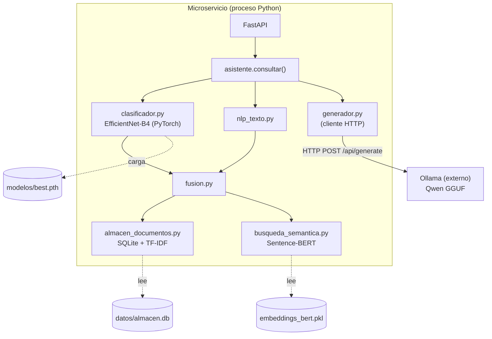
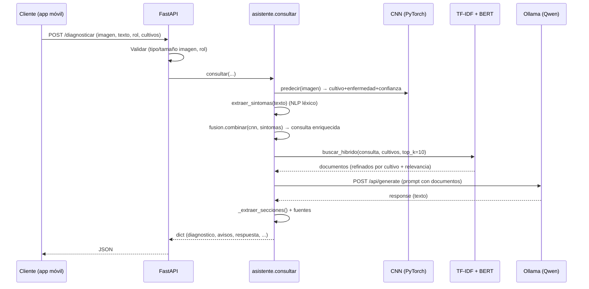
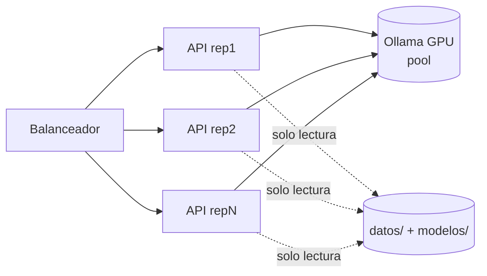

# Microservicio Backend — Documentación Técnica de Implementación

> **Audiencia:** equipo de backend que construirá el microservicio desde cero.
> **Alcance:** servir el sistema de diagnóstico agrícola (RAG con CNN + BERT + LLM)
> como API HTTP, sin volver a inspeccionar el repositorio del modelo.
> **Método:** toda afirmación está derivada del código fuente. Lo que **no** puede
> deducirse del repositorio se marca explícitamente con ⚠️ **NO DEDUCIBLE**.

---

## ⚠️ Hallazgo arquitectónico clave (leer primero)

**El repositorio NO ejecuta el LLM en proceso.** La inferencia del modelo de lenguaje
se **delega a [Ollama](https://ollama.com)**, un servidor externo, mediante una llamada
HTTP `POST /api/generate` (ver [`modulos/generador.py`](../modulos/generador.py) líneas
28, 143–193).

Consecuencia directa para el backend:

| Aspecto | ¿Quién lo maneja? | Evidencia |
|---|---|---|
| Pesos del LLM, formato (GGUF) | **Ollama** (externo) | El código solo usa el *tag* `"qwen3.5:0.8b"` |
| Tokenizador del LLM | **Ollama** (interno) | No hay tokenizer del LLM en el repo |
| KV-cache del LLM | **Ollama** | No hay gestión de cache en el repo |
| Cuantización del LLM | **Ollama** (GGUF) | No hay código de cuantización |
| GPU/CPU del LLM | **Ollama** | El repo no asigna device al LLM |
| **CNN (EfficientNet-B4)** | **En proceso (PyTorch)** | `modulos/clasificador.py` |
| **Embeddings (Sentence-BERT)** | **En proceso (sentence-transformers)** | `modulos/busqueda_semantica.py` |
| **TF-IDF + SQLite** | **En proceso** | `modulos/almacen_documentos.py` |
| **Orquestación RAG** | **En proceso** | `modulos/asistente.py` |

> **El microservicio a construir es una capa de orquestación RAG**, NO un servidor de
> inferencia de LLM. Carga en proceso la CNN y BERT; para el LLM actúa como **cliente
> HTTP de Ollama**. Varias secciones que pediste (tokenizer, KV-cache, streaming de
> tokens, GPU del LLM) corresponden a Ollama y se documentan como tal.

---

## 1. Arquitectura del modelo

El sistema combina **tres modelos** + dos índices clásicos. Derivado del código:

### 1.1 Modelo de lenguaje (generación) — el "LLM" del microservicio
- **Tipo:** LLM autoregresivo decoder-only de la familia **Qwen**.
- **Tag/identificador:** `qwen3.5:0.8b` (por defecto), configurable por entorno
  `QWEN_MODELO` (`generador.py:29`). En la nube se sugiere `qwen3.5:4b` (`generador.py:26`).
- **Framework de serving:** **Ollama** (backend llama.cpp / formato **GGUF**, cuantizado).
- **Acceso:** HTTP `POST {OLLAMA_URL}` → por defecto `http://localhost:11434/api/generate`.
- **Parámetros de inferencia fijados en código** (`generador.py:155–163`):
  - `stream: False` → **sin streaming actualmente**.
  - `think: False` → desactiva el modo razonamiento.
  - `options.temperature: 0.2` (baja, para fidelidad a los documentos).
- ⚠️ **NO DEDUCIBLE del repo:** nº de capas, dimensión oculta y formato exacto del
  checkpoint del LLM (provienen de la *model card* de Qwen, no del repositorio).
- **Verificado con `ollama show`** (no del repo, pero confirmado en el entorno):
  `qwen3.5:0.8b` → 873 M params, contexto **262144**, embedding 1024, quant **Q8_0**;
  `qwen3.5:4b` → 4.7 B params, contexto **262144**, embedding 2560, quant **Q4_K_M**.

### 1.2 Modelo de visión (CNN) — clasificación de imagen
Derivado de [`modulos/clasificador.py`](../modulos/clasificador.py):
- **Arquitectura:** **EfficientNet-B4** de `torchvision`, envuelta en un módulo con
  atributo `backbone` (`clasificador.py:_RedCultivoEnfermedad`).
- **Cabeza:** `Linear(in_features=1792, out=50)` → 50 clases (cultivo+enfermedad).
- **Checkpoint:** `modelos/best.pth` (dict con `model`, `class_mapping`, `metricas`).
- **Formato:** `state_dict` PyTorch (`.pth`), cargado con `torch.load(..., weights_only=False)`.
- **Preprocesado:** `Resize(380×380)` + `ToTensor` + `Normalize(mean ImageNet, std ImageNet)`
  (`clasificador.py` constantes `_TAM_ENTRADA=380`, `_MEAN`, `_STD`).
- **Umbral de confianza:** `0.50` (`_UMBRAL_CONFIANZA`).

### 1.3 Modelo de embeddings (BERT) — búsqueda semántica
Derivado de [`modulos/busqueda_semantica.py`](../modulos/busqueda_semantica.py):
- **Modelo:** `paraphrase-multilingual-MiniLM-L12-v2` (Sentence-BERT, multilingüe).
- **Framework:** `sentence-transformers`.
- **Dimensión de embedding:** **384** (deducido del corpus: `vectores_cultivos.pkl` es
  `(N, 384)`; el modelo MiniLM-L12 produce 384 dims).
- **Embeddings persistidos:** `datos/embeddings_bert.pkl` (`{ids, embeddings}` pickle).
- **Similitud:** coseno (`sklearn.metrics.pairwise.cosine_similarity`).

### 1.4 BETO fine-tuneado (clasificador de texto) — ⚠️ NO integrado al runtime
- **Existe** en `modelos/modelo_beto/` (entrenado por `scripts/finetune_beto.py`:
  base `dccuchile/bert-base-spanish-wwm-uncased`, tarea texto→cultivo, 9 clases).
- **NO está conectado** a `asistente.py` ni a `generador.py`. El runtime actual **no lo
  usa**. Documentado aquí por completitud; integrarlo es trabajo futuro.

### 1.5 Índices clásicos
- **TF-IDF:** `sklearn.TfidfVectorizer(ngram_range=(1,2), sublinear_tf=True)`,
  persistido en `datos/tfidf.pkl` (`almacen_documentos.py`).
- **SQLite:** `datos/almacen.db`, tablas `documentos(cultivo, enfermedad, fuente, texto,
  fragmento)` y `cache_topk(enfermedad, doc_ids, actualizado)`.

### 1.6 Archivos necesarios vs. opcionales

| Archivo | ¿Necesario? | Para qué |
|---|---|---|
| `modelos/best.pth` | **Necesario** | CNN (clasificación de imagen) |
| `datos/almacen.db` | **Necesario** | corpus + caché Top-K |
| `datos/tfidf.pkl` | **Necesario** | búsqueda léxica |
| `datos/embeddings_bert.pkl` | **Necesario** (modo híbrido/semántico) | búsqueda BERT |
| Modelo BERT (descarga HF, ~120 MB) | **Necesario** | generar embeddings de consulta |
| Ollama + modelo `qwen3.5:*` | **Necesario** (modo online) | generación de texto |
| `modelos/modelo_beto/` | **Opcional** | no usado por el runtime |
| `datos/corpus_combinado.json` | **Opcional** (insumo de build) | reconstruir el almacén |

### 1.7 Diagrama de componentes



---

## 2. Flujo interno de inferencia

Derivado de `asistente.consultar()` y `generador.responder()`:



**Etapa por etapa:**

1. **Cliente:** envía imagen (multipart) + texto de síntomas + rol + cultivos.
2. **API / Validación:** verifica método HTTP, tipo MIME, tamaño de imagen, rol válido.
   *(Hoy esta validación NO existe en el repo — debe añadirse en la capa API.)*
3. **Tokenización:** ⚠️ El microservicio **no tokeniza el prompt del LLM** — Ollama lo
   hace internamente. Sí tokeniza implícitamente la consulta para BERT
   (`SentenceTransformer.encode`) y para TF-IDF (`TfidfVectorizer.transform`).
4. **Preparación del prompt:** `generador._construir_prompt()` arma un prompt en español
   con: estilo según rol, reglas de seguridad del dominio, diagnóstico, síntomas y los
   documentos recuperados (cada uno recortado a `_MAX_CHARS_DOC=3500` chars).
5. **Carga del modelo:** CNN y BERT se cargan **en proceso** (singletons perezosos, ver
   §5). El LLM **ya está cargado en Ollama** (proceso aparte).
6. **Inferencia:**
   - CNN: `torch.softmax(modelo(tensor))` → argmax (`clasificador.predecir`).
   - IR: coseno sobre TF-IDF y embeddings BERT (`busqueda_semantica.buscar_hibrido`,
     pesos `0.4·TF-IDF + 0.6·BERT`).
   - LLM: `requests.post(OLLAMA_URL, json={...})` (`generador._llamar_ollama`).
7. **Postprocesamiento:** `_quitar_pensamiento()` elimina bloques `<think>…</think>`;
   `_extraer_secciones()` separa DIAGNÓSTICO/TRATAMIENTO/PREVENCIÓN/FUENTES por regex;
   las fuentes se derivan de los metadatos de los documentos.
8. **Streaming:** ⚠️ **No implementado** (`stream: False`). Ver §7 para añadirlo.
9. **Respuesta:** `dict` con `modo`, `diagnostico`, `sintomas`, `avisos`, `n_documentos`,
   `documentos`, `respuesta{texto, tratamiento, prevencion, fuentes}`.

---

## 3. Dependencias del microservicio

**Confirmadas en el repo** (`requirements.txt`) y por el entorno verificado:

| Librería | Versión (repo / observada) | Uso (evidencia) |
|---|---|---|
| Python | **3.11** (CLAUDE.md) | runtime |
| torch | `>=2.0.0` (obs. 2.5.1+cu121) | CNN, tensores |
| torchvision | `>=0.15.0` (obs. 0.20.1+cu121) | EfficientNet-B4 |
| pillow | `>=9.0.0` | carga de imágenes |
| scikit-learn | `>=1.3.0` (obs. 1.8.0) | TF-IDF, coseno, métricas |
| sentence-transformers | `>=2.2.0` | embeddings BERT |
| nltk | `>=3.8.0` | stopwords (build de corpus) |
| pypdf | `>=3.0.0` | carga de PDFs |
| cryptography | `>=3.1` | PDFs cifrados |
| requests | `>=2.31.0` | **cliente HTTP a Ollama** |
| numpy | `>=1.24.0` | álgebra |
| gradio | `>=4.0.0` | interfaz de pruebas (no producción) |

**A AÑADIR para el microservicio** (no están en el repo — son de la capa API):

| Librería | Versión mínima recomendada | Uso |
|---|---|---|
| fastapi | `>=0.110` | framework API |
| uvicorn[standard] | `>=0.29` | servidor ASGI (dev) |
| gunicorn | `>=21` | gestor de workers (prod) |
| python-multipart | `>=0.0.9` | recibir imágenes `multipart/form-data` |
| pydantic | `>=2.6` (viene con FastAPI) | validación de esquemas |
| prometheus-client | `>=0.20` | métricas (§15) |

> ⚠️ **NO presentes / NO necesarias** según el código: `vLLM`, `TensorRT-LLM`,
> `llama-cpp-python`, `accelerate`, `bitsandbytes`, `sentencepiece`. El LLM se sirve por
> **Ollama externo**, así que el microservicio **no** requiere esas librerías de
> inferencia de LLM. Incluirlas sería contradecir el código.

---

## 4. Estructura recomendada del proyecto

El proyecto **ya tiene** un núcleo reutilizable en `modulos/`. La estructura del
microservicio lo envuelve sin duplicar lógica:

```
microservice/
│
├── app/
│   ├── api/            # routers FastAPI (endpoints)
│   │   ├── diagnostico.py
│   │   ├── salud.py
│   │   └── embeddings.py
│   ├── services/       # adaptadores a modulos/ (orquestación)
│   │   └── inferencia.py
│   ├── models/         # carga/singletons de CNN y BERT
│   │   └── cargador.py
│   ├── schemas/        # modelos Pydantic (request/response)
│   │   └── diagnostico.py
│   ├── config/         # settings desde variables de entorno
│   │   └── settings.py
│   ├── utils/          # validación de imágenes, logging
│   └── main.py         # crea la app, eventos startup/shutdown
│
├── modulos/            # NÚCLEO existente (reutilizado tal cual)
├── modelos/            # best.pth (montado como volumen)
├── datos/              # almacen.db, índices (volumen)
├── Dockerfile
├── docker-compose.yml
├── requirements.txt
├── pyproject.toml
└── README.md
```

**Responsabilidad de cada carpeta:**
- `app/api/` — define rutas, valida con Pydantic, traduce HTTP ↔ llamadas de servicio.
  No contiene lógica de modelos.
- `app/services/` — orquesta: llama a `modulos.asistente.consultar()`. Punto único de
  integración con el núcleo.
- `app/models/` — carga perezosa y *singletons* de CNN y BERT; *warmup* en `startup`.
- `app/schemas/` — contratos Pydantic (entrada/salida), espejo del `dict` de `consultar`.
- `app/config/` — lee `OLLAMA_URL`, `QWEN_MODELO`, etc. (las que ya usa `generador.py`).
- `app/utils/` — validación de imagen (tipo/tamaño), logging estructurado.
- `app/main.py` — `FastAPI()`, registra routers, eventos de ciclo de vida.
- `modulos/` — **no se modifica**; es el núcleo del modelo.

---

## 5. Inicialización del modelo

Derivado del código: CNN y BERT ya usan **carga perezosa con singleton**.

- **CNN** (`clasificador._cargar_modelo`): variable global `_modelo`; se carga la primera
  vez que se llama `predecir()` y se reutiliza. `torch.load` + `eval()`.
- **BERT** (`busqueda_semantica._obtener_modelo`): global `_modelo`; `SentenceTransformer`
  se instancia una vez.
- **Embeddings/TF-IDF/SQLite:** se leen de disco por consulta; conviene cachearlos.

**Recomendaciones para el microservicio:**
- **Cuándo cargar:** en el evento `@app.on_event("startup")` (o `lifespan`), forzar la
  carga llamando una vez a `clasificador.predecir(imagen_dummy)` y
  `busqueda_semantica._obtener_modelo()` → **warmup** (evita latencia en la 1ª petición
  real; además dispara la descarga del modelo BERT de HuggingFace si falta).
- **Singleton:** ya está implementado a nivel de módulo; **un modelo por proceso/worker**.
- **Cache:** mantener en memoria el índice TF-IDF y los embeddings (hoy `_cargar_indice`
  y `_cargar_embeddings` leen el pickle en cada búsqueda → **cachear en memoria** para
  no pegarle a disco por petición; es una mejora recomendada).
- **Reutilización:** entre peticiones, los singletons se reutilizan; no recargar.
- **Memoria:** cada worker carga su **propia copia** (CNN ~71 MB en disco + BERT ~120 MB
  + PyTorch runtime) → ver §9.
- **LLM:** no se inicializa aquí; Ollama lo carga. Conviene "calentar" Ollama con una
  petición trivial al arrancar (la 1ª carga del modelo GGUF tarda).

---

## 6. API REST recomendada

Diseñada para reflejar `asistente.consultar()` (entrada/salida reales).

### `POST /diagnosticar` (principal)
- **Request** (`multipart/form-data`): `imagen` (archivo, requerido), `texto` (str, opc.),
  `rol` (`agricultor|aprendiz`), `cultivos` (CSV, opc.).
- **Response 200** (`application/json`): espejo del `dict` de `consultar` (§2.9).
- **Errores:** `400` imagen/parametros inválidos; `415` tipo no soportado; `503` Ollama
  caído (mapear el `RuntimeError` de `_llamar_ollama`); `504` timeout de Ollama.

```json
// 200 OK
{
  "modo": "online",
  "diagnostico": {"cultivo":"calabaza","enfermedad":"oídio",
    "confianza_original":0.47,"confianza_ajustada":0.62,"explicacion":"..."},
  "sintomas": ["oidio","polvo blanco"],
  "avisos": ["La confianza de la imagen es baja (47%)..."],
  "n_documentos": 9,
  "respuesta": {"texto":"DIAGNÓSTICO: ...","tratamiento":"...","prevencion":"...",
    "fuentes":["Guía ... INIFAP 2020"]}
}
```

### `POST /generate` (solo LLM, sin RAG) — opcional
- Envoltura directa de `generador._llamar_ollama(prompt)`. Útil para pruebas.
- **Request:** `{ "prompt": str, "temperature"?: float }`. **Response:** `{ "texto": str }`.

### `POST /embeddings`
- Envoltura de `busqueda_semantica._obtener_modelo().encode(textos)`.
- **Request:** `{ "textos": [str] }`. **Response:** `{ "embeddings": [[float]], "dim": 384 }`.

### `POST /clasificar` (solo CNN)
- Envoltura de `clasificador.predecir(imagen)`.
- **Response:** `{ "cultivo", "enfermedad", "confianza", "clase_cnn", "confianza_baja" }`.

### `GET /health` (liveness)
- Devuelve `200` si el proceso vive. No comprueba dependencias.

### `GET /ready` (readiness)
- `200` solo si: CNN cargada, BERT cargado, **Ollama responde** (`GET /api/tags`).
  Si Ollama no responde → `503` (el modo online no funcionaría).

### `GET /metrics`
- Métricas Prometheus (latencia, peticiones, errores). Ver §15.

> ⚠️ `/chat` (multi-turno) **no es deducible** del repo: el sistema es *single-turn*
> (una consulta → una respuesta, sin historial). Implementarlo requiere diseñar gestión
> de conversación que hoy no existe.

---

## 7. Streaming

**Estado actual (código):** **NO hay streaming.** `generador.py:158` fija `stream: False`
y `responder()` devuelve el texto completo de una sola vez.

**Soporte del backend de inferencia:** Ollama **sí** soporta streaming (NDJSON por
`stream: true`). Por tanto el streaming es viable, pero **hay que implementarlo**:

- **HTTP Chunked / SSE (recomendado):** en el endpoint, llamar a Ollama con `stream: true`
  y `requests.post(..., stream=True)`, iterar `resp.iter_lines()`, parsear cada línea
  JSON (`{"response": "...", "done": false}`) y reenviarla al cliente como evento SSE
  (`text/event-stream`) o `StreamingResponse` de FastAPI.
- **WebSocket:** alternativa para apps que ya usen WS; mismo origen de tokens.
- **Tokens incrementales:** los provee Ollama campo `response` por chunk; el repo no los
  procesa hoy.

> Nota: `_extraer_secciones()` opera sobre el texto **completo**. Con streaming, el parseo
> en secciones debe hacerse al final (tras `done: true`) o adaptarse a streaming parcial.

---

## 8. Manejo de concurrencia

Derivado del código + naturaleza de PyTorch:

- **Inferencia PyTorch es bloqueante** (CNN, BERT). En FastAPI async, ejecutar en
  *threadpool* (`fastapi.concurrency.run_in_threadpool`) para no bloquear el event loop.
- **Workers:** Gunicorn + `UvicornWorker`. **Cada worker carga su propia copia** de CNN y
  BERT → la concurrencia real está limitada por RAM/VRAM (§9). Empezar con 1–2 workers.
- **El LLM no es cuello del proceso Python**, sino de **Ollama**: Ollama procesa las
  peticiones (con su propia cola interna). Varias réplicas del microservicio comparten un
  Ollama → Ollama puede ser el punto de saturación.
- **Locks:** los singletons de modelo son de solo-lectura en inferencia (no requieren lock
  para `forward`); sí conviene un lock alrededor de la **primera** carga perezosa para
  evitar doble carga en arranque concurrente (o forzarla en `startup`, que lo evita).
- **Batching:** ⚠️ **No implementado.** El código procesa **una imagen/consulta por
  llamada**. Batching de CNN/BERT requeriría agrupar peticiones (micro-batching) — mejora
  futura. Ollama hace su propio batching de tokens internamente.
- **Throughput:** limitado por (a) inferencia CNN/BERT por worker y (b) capacidad de
  Ollama para el LLM. Medir con carga real (§19.11).

---

## 9. Gestión de memoria

**Datos del repo / entorno verificado** (torch 2.5.1+cu121, GPU RTX 3050 6 GB):

- **RAM por worker (estimado):** runtime PyTorch + CNN (`best.pth` ~71 MB) + BERT
  (~120 MB) + índices en memoria (TF-IDF + embeddings, depende del corpus; corpus actual
  ~1829 fragmentos → embeddings `1829×384×4 B ≈ 2.8 MB`). **Estimar 2–3 GB/worker** por el
  runtime de PyTorch.
- **VRAM:** si CNN/BERT corren en GPU, consumo modesto (cientos de MB). El **LLM corre en
  Ollama** (otra reserva de VRAM/RAM, fuera de este proceso).
- **KV-cache:** ⚠️ pertenece a **Ollama**, no al microservicio.
- **Límite de contexto (verificado con `ollama show`):** `qwen3.5:0.8b` y `qwen3.5:4b`
  tienen ambos **262 144 tokens (256K)** de ventana de contexto. El prompt con `top_k=10`
  documentos × `_MAX_CHARS_DOC=3500` ≈ 35 000 caracteres (~12K tokens) usa **<5%** del
  contexto → **NO hay riesgo de overflow** con estos modelos. (La cuantización —Q8_0 / Q4_K_M—
  no reduce la ventana de contexto.) Reducir los documentos enviados al LLM es una mejora de
  **calidad/latencia** (evitar "lost in the middle"), no una necesidad de contexto.
- **Limpieza:** liberar tensores intermedios (`torch.no_grad()` ya se usa en
  `predecir`/`evaluar`); en GPU, `torch.cuda.empty_cache()` si hay fragmentación.
- **Límites:** fijar `MAX_IMAGEN_MB` y rechazar imágenes grandes antes de decodificarlas.

---

## 10. Docker

Basado en las dependencias reales (torch CPU para imagen liviana, salvo que se use GPU):

```dockerfile
# Dockerfile
FROM python:3.11-slim

# Dependencias del sistema mínimas (pillow/torch)
RUN apt-get update && apt-get install -y --no-install-recommends \
        libgl1 libglib2.0-0 && rm -rf /var/lib/apt/lists/*

WORKDIR /app

# Torch CPU (más liviano). Para GPU, usar la imagen nvidia/cuda y torch+cu121.
RUN pip install --no-cache-dir torch torchvision \
        --index-url https://download.pytorch.org/whl/cpu

COPY requirements.txt .
RUN pip install --no-cache-dir -r requirements.txt \
    fastapi "uvicorn[standard]" gunicorn python-multipart prometheus-client

# Pre-descargar el modelo BERT dentro de la imagen (evita descarga en runtime)
RUN python -c "from sentence_transformers import SentenceTransformer; \
    SentenceTransformer('paraphrase-multilingual-MiniLM-L12-v2')"

COPY modulos/ ./modulos/
COPY app/ ./app/
# best.pth y datos/ se montan como volúmenes (no copiar pesos a la imagen)

EXPOSE 8000
CMD ["gunicorn", "app.main:app", "-k", "uvicorn.workers.UvicornWorker", \
     "-w", "2", "-b", "0.0.0.0:8000", "--timeout", "180"]
```

**Optimizaciones:**
- `torch ... /whl/cpu` reduce la imagen ~2 GB respecto a la build CUDA.
- `.dockerignore`: excluir `Entrenamiento/`, `extras/`, `tests/`, `*.pdf`, `venv/`,
  `modelos/modelo_beto/`.
- Pesos (`best.pth`) y `datos/` como **volúmenes**, no horneados en la imagen.

---

## 11. Docker Compose

```yaml
# docker-compose.yml
services:
  api:
    build: .
    ports: ["8000:8000"]
    environment:
      OLLAMA_URL: "http://ollama:11434/api/generate"
      QWEN_MODELO: "qwen3.5:4b"     # en la nube cabe el grande
      OLLAMA_TIMEOUT: "180"
      LOG_LEVEL: "INFO"
    volumes:
      - ./modelos:/app/modelos:ro
      - ./datos:/app/datos:ro
    depends_on: [ollama]

  ollama:
    image: ollama/ollama:latest
    ports: ["11434:11434"]
    volumes: [ollama_models:/root/.ollama]
    # GPU (NVIDIA): descomentar
    # deploy:
    #   resources:
    #     reservations:
    #       devices: [{driver: nvidia, count: 1, capabilities: [gpu]}]

volumes:
  ollama_models:
```

> Tras levantar: `docker compose exec ollama ollama pull qwen3.5:4b` (una vez).

---

## 12. Variables de entorno

**Ya leídas por el código** (`generador.py`):

| Variable | Default (código) | Uso |
|---|---|---|
| `OLLAMA_URL` | `http://localhost:11434/api/generate` | endpoint de Ollama |
| `QWEN_MODELO` | `qwen3.5:0.8b` | tag del modelo |
| `OLLAMA_TIMEOUT` | `120` | timeout HTTP (s) |

**A AÑADIR en la capa API** (no existen aún en el repo — marcar como nuevas):

| Variable | Ejemplo | Uso |
|---|---|---|
| `HOST` | `0.0.0.0` | bind del servidor |
| `PORT` | `8000` | puerto |
| `LOG_LEVEL` | `INFO` | logging |
| `MAX_IMAGEN_MB` | `8` | límite de subida |
| `WORKERS` | `2` | workers Gunicorn |
| `API_KEY` | `***` | autenticación (§16) |
| `DEVICE` | `cuda`/`cpu` | device de CNN/BERT (hoy autodetect en torch) |

> ⚠️ `MAX_TOKENS`, `TOP_P` **no se usan** en el código actual (solo `temperature: 0.2`).
> Si se quieren exponer, hay que añadirlos a `options` del cuerpo de `_llamar_ollama`.

---

## 13. Configuración GPU

Distinguir **dos planos** (clave en este sistema):

| Plano | Quién decide device | Cómo |
|---|---|---|
| **CNN + BERT** (en proceso) | PyTorch / sentence-transformers | autodetect `torch.cuda.is_available()`; hoy el código no fija device explícito en `clasificador` (usa CPU por defecto en `predecir`; BERT usa el device por defecto de la lib) |
| **LLM** | **Ollama** | variables de Ollama (p. ej. `OLLAMA_GPU_LAYERS`), fuera de este repo |

- **CUDA (NVIDIA):** entorno verificado `torch 2.5.1+cu121`, GPU RTX 3050. Para usar GPU
  en CNN/BERT habría que mover tensores/modelo a `cuda` (mejora menor; hoy CPU funciona).
- **CPU:** soportado tal cual; es el modo por defecto del `clasificador.predecir`.
- **ROCm (AMD):** ⚠️ **NO deducible**; requeriría torch+ROCm y un Ollama compatible.
- **Apple Silicon (MLX/MPS):** ⚠️ **NO deducible/NO usado**. PyTorch MPS podría servir a
  CNN/BERT; el LLM dependería de un Ollama para macOS. No hay evidencia en el repo.

---

## 14. Escalabilidad

- **Horizontal:** la API es **stateless** (el corpus es de solo lectura; los `cultivos`
  llegan en la petición — confirmado en `asistente.consultar(cultivos=...)`). → N réplicas
  tras un balanceador. **Ollama es el recurso compartido** y posible cuello → escalar
  Ollama por separado (idealmente con GPU).
- **Vertical:** más CPU/RAM por instancia permite más workers (cada uno con su copia de
  modelos).
- **Balanceadores:** Nginx/Traefik/ALB delante de las réplicas de la API.
- **Kubernetes:** `Deployment` para la API (HPA por CPU/latencia) + `Deployment`/`StatefulSet`
  para Ollama (nodos con GPU, `nodeSelector`). `readinessProbe → /ready`, `livenessProbe → /health`.
- **Réplicas/Autoscaling:** HPA de la API por uso de CPU o métrica de latencia (§15). Ollama
  escala peor (estado de modelo cargado) → dimensionar por capacidad, no autoscaling agresivo.



---

## 15. Observabilidad

Hoy el repo **solo usa `print`** (no hay logging estructurado ni métricas). A implementar:

- **Logging:** estructurado (JSON) por petición: `modo`, `cultivo/enfermedad`, `confianza`,
  `n_documentos`, latencia, modelo usado. **No registrar imágenes** (privacidad).
- **Métricas (Prometheus):** `prometheus-client` → contador de peticiones, histograma de
  latencia (total y por etapa: CNN / IR / Ollama), contador de errores, gauge de
  disponibilidad de Ollama. Exponer en `GET /metrics`.
- **OpenTelemetry / tracing:** instrumentar las etapas (CNN → IR → Ollama) para ver dónde
  se va el tiempo (la llamada a Ollama suele dominar). Exportar a Jaeger/Tempo.
- **Health checks:** `/health` (liveness) y `/ready` (readiness con chequeo de Ollama
  `GET /api/tags`).

---

## 16. Seguridad

Hoy el repo **no tiene** autenticación ni validación de entrada en una capa API (porque no
hay API). A implementar:

- **Autenticación:** API Key por header (`X-API-Key`) o JWT (validado por el backend de la
  app). El microservicio **no** maneja login de usuarios finales (CLAUDE.md: el login va en
  el back/app móvil).
- **Rate limiting:** por IP/clave (p. ej. `slowapi` o el del proxy) — evita saturar Ollama.
- **CORS:** restringir orígenes a los dominios de la app.
- **Validación de entrada:** tipo MIME y tamaño de imagen (`MAX_IMAGEN_MB`), `rol` en
  `{agricultor, aprendiz}`, longitud máxima de `texto`. Rechazar archivos no-imagen
  (recordar el caso real del PDF/HTML corrupto detectado en este proyecto).
- **HTTPS:** terminado en el proxy/balanceador.
- **Secretos:** solo por variables de entorno / gestor de secretos; nunca en código.
- **Regla de dominio (ya en código):** el prompt prohíbe inventar dosis (`generador.py`
  reglas 1–3); mantenerla.

---

## 17. Rendimiento

Optimizaciones, distinguiendo plano LLM (Ollama) y plano CNN/BERT (proceso):

- **Cuantización (LLM):** responsabilidad de **Ollama** (GGUF ya cuantizado; el `0.8b` es
  ~Q4). Elegir el quant según latencia/calidad. No es código de este repo.
- **Cachear índices en memoria:** hoy `_cargar_indice`/`_cargar_embeddings` leen el pickle
  **en cada búsqueda** → cargarlos una vez al `startup` y reusar (mejora directa de
  latencia, derivada del código).
- **Caché de respuestas:** el sistema ya tiene **caché Top-K** en SQLite por enfermedad
  (`almacen_documentos.guardar_topk/recuperar_topk`); aprovecharlo evita búsquedas repetidas.
- **Batching (CNN/BERT):** agrupar peticiones concurrentes (micro-batching) si el tráfico
  lo justifica. No implementado.
- **Compilación:** `torch.compile()` sobre la CNN puede acelerar inferencia (PyTorch 2.x).
- **GPU para CNN/BERT:** mover a `cuda` reduce latencia bajo carga (hoy CPU).
- **Reducir contexto del LLM:** bajar `top_k`/`_MAX_CHARS_DOC` reduce tokens → menor
  latencia de Ollama (ver riesgo de contexto en §9).

---

## 18. Riesgos técnicos

Derivados del código y la arquitectura:

| Riesgo | Causa (evidencia) | Mitigación |
|---|---|---|
| **Dependencia dura de Ollama** | `_llamar_ollama` lanza `RuntimeError` si Ollama no responde | `/ready` que valide Ollama; mensaje de error claro; reintentos |
| ~~Overflow de contexto~~ (descartado) | Verificado: contexto 256K en 0.8b y 4b (§9); el prompt usa <5% | No aplica. Reducir docs al LLM es por calidad, no por contexto |
| **Timeout** | `OLLAMA_TIMEOUT=120` y 1ª carga del modelo GGUF es lenta | warmup de Ollama; subir timeout; `504` claro |
| **OOM (RAM)** | cada worker carga CNN+BERT+torch (~2–3 GB) | limitar workers; medir; instancia con RAM suficiente |
| **Lectura de pickle por petición** | `_cargar_indice`/`_cargar_embeddings` (latencia/IO) | cachear en memoria al `startup` |
| **Concurrencia / bloqueo del event loop** | inferencia PyTorch es síncrona | `run_in_threadpool`; workers |
| **Entrada maliciosa / no-imagen** | sin validación en repo | validar MIME/tamaño (§16) |
| **Cuello en Ollama** | un Ollama para N réplicas | escalar Ollama (GPU); colas |
| **Fuga de memoria GPU** | fragmentación en cargas largas | `torch.cuda.empty_cache()`; reciclar workers |
| **Calidad del 0.8b** | modelo pequeño puede divagar | prompt estricto (ya), o `qwen3.5:4b` en nube |

---

## 19. Guía completa de implementación (paso a paso)

> Objetivo: que un backend construya el microservicio sin volver a leer el repo del modelo.

### 19.1 Preparación del entorno
1. Python 3.11. Crear venv: `python -m venv .venv && . .venv/Scripts/activate` (Win) o `source` (Unix).
2. Instalar Ollama y descargar el modelo: `ollama pull qwen3.5:0.8b` (o `4b` en servidor).

### 19.2 Instalación de dependencias
3. `pip install -r requirements.txt` + `fastapi "uvicorn[standard]" gunicorn python-multipart prometheus-client`.

### 19.3 Organización del proyecto
4. Crear `app/` según §4. **No tocar `modulos/`** (núcleo). Montar `modelos/` y `datos/`.

### 19.4 Integración del modelo
5. En `app/services/inferencia.py`, importar el orquestador:
   `from modulos.asistente import consultar`. **Esa función ya une CNN + NLP + IR + LLM.**
6. El servicio convierte la imagen recibida (bytes) en algo que acepte `clasificador.predecir`
   (acepta ruta o `PIL.Image`; con bytes → `Image.open(BytesIO(bytes))`).

### 19.5 Carga del tokenizer
7. ⚠️ **El LLM no expone tokenizer aquí** (lo maneja Ollama). El único "tokenizado" en
   proceso es interno de BERT/TF-IDF y no requiere configuración manual. **Omitir** carga
   de tokenizer del LLM (no aplica a esta arquitectura).

### 19.6 Implementación del servicio de inferencia
8. `inferencia.diagnosticar(imagen_bytes, texto, rol, cultivos)`:
   - abre imagen, llama `consultar(imagen=img, texto=texto, rol=rol, cultivos=cultivos)`
   - lo ejecuta en `run_in_threadpool` (es síncrono).

### 19.7 Implementación de los endpoints
9. `app/api/diagnostico.py` → `POST /diagnosticar` (multipart). Validar con Pydantic +
   `UploadFile`. Mapear `RuntimeError` de Ollama a `503/504`.
10. Añadir `/clasificar`, `/embeddings`, `/health`, `/ready`, `/metrics` (§6).

### 19.8 Configuración del streaming (opcional)
11. Para SSE: nuevo endpoint que llame a Ollama con `stream:true`, itere `iter_lines()` y
    haga `StreamingResponse`. Recordar parsear secciones al final (§7).

### 19.9 Manejo de errores
12. Capturar: imagen inválida → `400/415`; Ollama caído → `503`; timeout → `504`; resto →
    `500` con cuerpo JSON `{error, detalle}`. No filtrar trazas internas al cliente.

### 19.10 Dockerización
13. Usar el `Dockerfile` (§10) y `docker-compose.yml` (§11). Montar `modelos/` y `datos/`.
    `docker compose up --build` + `ollama pull` dentro del contenedor de Ollama.

### 19.11 Pruebas locales
14. Unitarias: el repo ya trae `tests/` para el núcleo. Para la API, usar
    `fastapi.testclient.TestClient` e **inyectar un generador falso** (el núcleo ya soporta
    `fn_generar` en `consultar`, ver `tests/test_asistente.py`) para no depender de Ollama.
15. Carga: `hey`/`locust` contra `/diagnosticar` para dimensionar workers y ver si Ollama
    satura.

### 19.12 Despliegue
16. Subir a un proveedor con contenedores. API en CPU; **Ollama idealmente con GPU**.
    Configurar variables (§12), HTTPS en el proxy, `pull` del modelo en Ollama.

### 19.13 Escalado
17. Escalar réplicas de la API (HPA) detrás del balanceador; dimensionar el pool de Ollama
    aparte (§14).

### 19.14 Monitoreo
18. Exponer `/metrics`, conectar Prometheus + Grafana; alertas por latencia de Ollama,
    tasa de error y disponibilidad (`/ready`). Tracing con OpenTelemetry (§15).

---

## Apéndice A — Mapa de "qué pediste" → "qué dice el código"

| Pediste | Realidad en el repo |
|---|---|
| Framework de inferencia LLM (vLLM/TensorRT/llama.cpp…) | **Ollama** (HTTP externo; GGUF/llama.cpp por debajo). No hay inferencia LLM en proceso |
| Formato del modelo LLM | GGUF (en Ollama). ⚠️ no presente en el repo |
| Tokenizer del LLM | Interno de Ollama. ⚠️ no en el repo |
| Streaming | No implementado (`stream:False`); Ollama lo soporta |
| Embeddings | Sí: Sentence-BERT en proceso (384-d) |
| RAG | Sí: TF-IDF + BERT + caché Top-K (`asistente.py`) |
| Tool calling | **No implementado** (ninguna evidencia) |
| KV-cache / cuantización / GPU del LLM | De **Ollama**, fuera del repo |
| GPU del proceso | CNN/BERT pueden ir en CUDA (torch+cu121 verificado); hoy CPU por defecto |

## Apéndice B — Información NO deducible del repositorio

Para completar el diseño, el equipo necesitaría además:
1. **Model card / `config.json` de `qwen3.5:*`** (ventana de contexto, vocab, tokenizer)
   — para dimensionar el límite de tokens y validar el riesgo de overflow (§9).
2. **Política de cuantización deseada en Ollama** (quant del GGUF) — afecta latencia/calidad.
3. **Requisitos de SLA** (latencia objetivo, RPS) — para dimensionar workers y el pool de Ollama.
4. **Infraestructura destino** (nube, GPU disponible) — para elegir CUDA/CPU y el plan de escalado.
